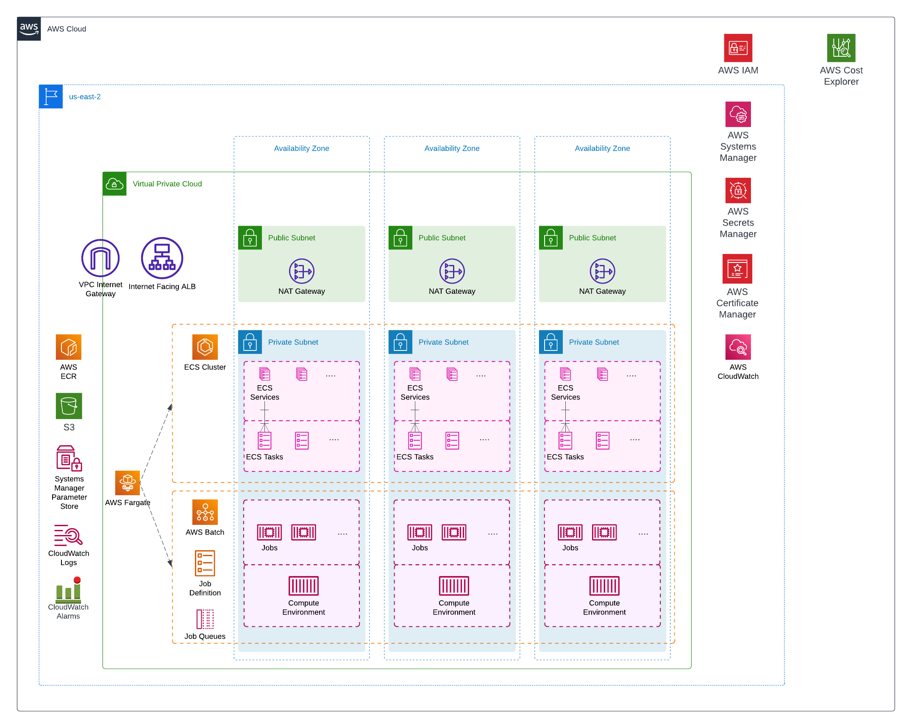

# AWS Starter Kit

The purpose of this repository is to show how to assemble Terraform configurations and CI/CD pipelines to run containerized applications on serverless infrastructure in AWS.

## Table of contents

- [TLDR](#tldr)
- [Architecture diagram](#architecture-diagram)
- [Directory structure](#directory-structure)
- [Secrets](#secrets)
- [Roadmap](#roadmap)

## TLDR

Terraform is used to define infrastructure as code, and GitHub Actions is used to run CI/CD.

Some highlights of the setup:

- Serverless containers running on Fargate in ECS and/or AWS Batch
- IAM based secrets management in AWS Secrets Manager
- CloudWatch logs
- Optional CloudWatch alarms (SNS to email)

## Architecture diagram

## Directory structure

| Name      | Description                                                                                                                    |
| --------- | ------------------------------------------------------------------------------------------------------------------------------ |
| .github   | Workflow files for GitHub Actions.                                                                               |
| terraform | Terraform configuration files.|

## Secrets

The following environment variables should be set as GitHub Secrets on the repository where you plan to run GH ActionsWorkflows (Settings -> Secrets):

- `AWS_ACCESS_KEY_ID_TF_AGENT` - permissioned so the TF agent can create resources
- `AWS_SECRET_ACCESS_KEY_TF_AGENT`

## Roadmap

Some additional pieces I'll try to add:

- [x] Multi-environment setup using AWS Fargate for ECS and Batch 
- [x] Basic CloudWatch logging and SNS Alarms
- [ ] Add cost breakdown and show how to calculate 
- [ ] Add open-source metrics and alerting solution, e.g. Grafana 

